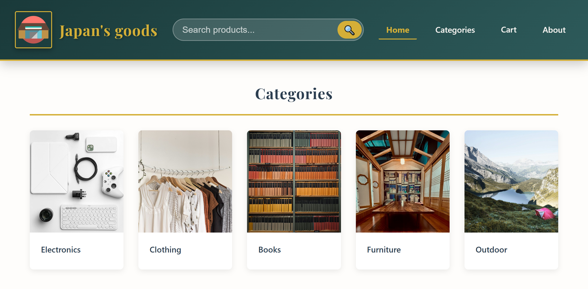
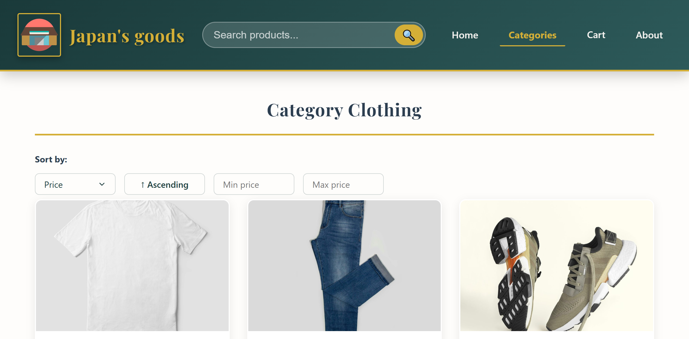

# 🛍️ Japan's Goods – React E‑commerce Shop

Modern, responsive online storefront built with **React**, **React Router**, and **SASS**. Features dynamic product listings, category browsing, shopping cart, mock checkout, and a clean component‑based architecture.

## ✨ Features

- 🏠 **Homepage** – Grid of product categories with smooth hover overlays.
- 🧭 **Category pages** – Filter products by category, sort by price/name/rating/stock, and filter by price range via URL search params.
- 🔍 **Product search** – Header search bar filters products by name across categories.
- 📦 **Product details** – Individual product view with image, rating, stock status, and add‑to‑cart.
- 🔖 **Smart category link** – The “Categories” nav link always points to the last viewed category (default: `electronics`), stored in `localStorage` via React Context.
- 🛒 **Shopping cart** – Add items from category or product pages, view totals, remove items, and see a live cart badge in the header.
- 💳 **Mock checkout** – Checkout page with a simulated payment form; clears the cart after a successful mock payment.
- 📱 **Fully responsive** layout with dedicated tablet and mobile breakpoints.
- 🎨 **SASS** – Modular styles with variables, partials, and BEM-like naming.
- 🔁 **React Router v6** – Nested routes, dynamic parameters, and a styled 404 fallback page.

## 🧰 Built With

- [React](https://reactjs.org/) – UI library
- [React Router](https://reactrouter.com/) – Client‑side routing
- [SASS](https://sass-lang.com/) – CSS preprocessor
- [Vite](https://vitejs.dev/) – Build tool

## 📁 Project Structure

```
📦Project structure
 ┣ 📂public
 ┃ ┣ 📜ai-robot.jpg
 ┃ ┣ 📜bicycle.jpg
 ┃ ┣ 📜books.jpg
 ┃ ┣ 📜bookshelf.jpg
 ┃ ┣ 📜clothing.jpg
 ┃ ┣ 📜comicBook.jpg
 ┃ ┣ 📜deskChair.jpg
 ┃ ┣ 📜electronics.jpg
 ┃ ┣ 📜furniture.jpg
 ┃ ┣ 📜headphones.jpg
 ┃ ┣ 📜jacket.jpg
 ┃ ┣ 📜jeans.jpg
 ┃ ┣ 📜lamp.jpg
 ┃ ┣ 📜laptop.jpg
 ┃ ┣ 📜logo.svg
 ┃ ┣ 📜magazine.jpg
 ┃ ┣ 📜monitor.jpg
 ┃ ┣ 📜novel.jpg
 ┃ ┣ 📜outdoor.jpg
 ┃ ┣ 📜photo-credits.txt
 ┃ ┣ 📜rollerSkates.jpg
 ┃ ┣ 📜scooter.jpg
 ┃ ┣ 📜skateboard.jpg
 ┃ ┣ 📜smartphone.jpg
 ┃ ┣ 📜sneakers.jpg
 ┃ ┣ 📜t-shirt.jpg
 ┃ ┣ 📜table.jpg
 ┃ ┗ 📜textbook.jpg
 ┣ 📂src
 ┃ ┣ 📂components
 ┃ ┃ ┣ 📂Footer
 ┃ ┃ ┃ ┗ 📜Footer.jsx
 ┃ ┃ ┣ 📂Header
 ┃ ┃ ┃ ┗ 📜Header.jsx
 ┃ ┃ ┗ 📂Layout
 ┃ ┃ ┃ ┗ 📜Layout.jsx
 ┃ ┣ 📂context
 ┃ ┃ ┣ 📜CartContext.jsx
 ┃ ┃ ┗ 📜CategoryContext.jsx
 ┃ ┣ 📂data
 ┃ ┃ ┗ 📜data.js
 ┃ ┣ 📂pages
 ┃ ┃ ┣ 📜About.jsx
 ┃ ┃ ┣ 📜Cart.jsx
 ┃ ┃ ┣ 📜Category.jsx
 ┃ ┃ ┣ 📜Checkout.jsx
 ┃ ┃ ┣ 📜Home.jsx
 ┃ ┃ ┣ 📜NotFound.jsx
 ┃ ┃ ┗ 📜ProductDetails.jsx
 ┃ ┣ 📂sass
 ┃ ┃ ┣ 📂components
 ┃ ┃ ┃ ┣ 📜Footer.sass
 ┃ ┃ ┃ ┣ 📜Header.sass
 ┃ ┃ ┃ ┗ 📜SortButtons.sass
 ┃ ┃ ┣ 📂pages
 ┃ ┃ ┃ ┣ 📜Cart.sass
 ┃ ┃ ┃ ┣ 📜Checkout.sass
 ┃ ┃ ┃ ┣ 📜Home.sass
 ┃ ┃ ┃ ┣ 📜NotFound.sass
 ┃ ┃ ┃ ┗ 📜Products.sass
 ┃ ┃ ┣ 📜index.sass
 ┃ ┃ ┣ 📜_globals.sass
 ┃ ┃ ┣ 📜_utils.sass
 ┃ ┃ ┗ 📜_variables.sass
 ┃ ┣ 📂utils
 ┃ ┃ ┣ 📜categoryStorage.js
 ┃ ┃ ┣ 📜renderStars.js
 ┃ ┃ ┗ 📜sortProducts.js
 ┃ ┣ 📜App.jsx
 ┃ ┗ 📜main.jsx
 ┣ 📜eslint.config.js
 ┣ 📜image-1.png
 ┣ 📜image.png
 ┣ 📜index.html
 ┣ 📜package-lock.json
 ┣ 📜package.json
 ┣ 📜README.md
 ┗ 📜vite.config.js
```

## 🚀 Getting Started

### Prerequisites

- Node.js (v16+)
- npm or yarn

### Installation

1. **Clone the repository**

    ```bash
    git clone https://github.com/your-username/japans-goods-shop.git
    cd japans-goods-shop
    ```

2. **Install dependencies**

    ```bash
    npm install
    ```

3. **Run the development server**

    ```bash
    npm run dev
    ```

    Open [http://localhost:5173](http://localhost:5173) to view it in the browser.

4. **Build for production**
    ```bash
    npm run build
    ```

## 🧠 How the “Last Category” Works

- The `CategoryProvider` (React Context) stores the last visited category in `localStorage` (default `'electronics'`).
- The `Categories` nav link uses `useCategory()` to read `lastCategory` and builds a dynamic route: `/category/${lastCategory}`.
- When a user visits any category page (e.g., `/category/books`), the `Category` component calls `updateCategory(categoryID)`, updating both context and `localStorage`.

> This creates a persistent, user‑friendly navigation that remembers your last browsing interest.

## 🛒 Shopping Cart & Checkout

- The `CartProvider` (React Context) manages cart state across the app.
- Click **Shop Now** on a category card or product details page to add an item.
- The header shows a badge with the total item count.
- The **Cart** page lists items with quantity, subtotals, and a remove option.
- **Proceed to Checkout** opens a mock payment form at `/checkout`.
- After submitting payment, the cart is cleared and a success screen is shown.
- Visiting `/checkout` with an empty cart redirects back to `/cart`.

## 🗂️ Data Model

`data.js` exports two arrays:

- **categories** – `{ id, name, img }`
- **products** – `{ id, categoryId, name, price, img, description, rating, inStock }`

All images are stored in the `public/` folder and referenced by path (e.g., `/laptop.jpg`). Product and category photos come from [Unsplash](https://unsplash.com/license); the photographers are listed in `public/photo-credits.txt`.

## 🎨 Styling Approach

- Global styles are imported in `main.jsx` via `./sass/index.sass`.
- Component‑specific SASS files live in `sass/components/` or `sass/pages/`.
- BEM‑like naming (e.g., `.product-card__image-wrapper`, `.cart-sidebar__total`) keeps styles maintainable.
- Responsive breakpoints cover desktop, tablet (769px–1024px), and mobile.

## 🔧 Available Scripts

| Command           | Description                      |
| ----------------- | -------------------------------- |
| `npm run dev`     | Start Vite dev server            |
| `npm run build`   | Build for production             |
| `npm run preview` | Preview production build locally |
| `npm run lint`    | Run ESLint (if configured)       |

## 📸 Screenshots




## 🤝 Contributing

Pull requests are welcome. For major changes, please open an issue first to discuss what you would like to change.

## 📄 License

[MIT](https://choosealicense.com/licenses/mit/)

## 👤 Author

**George Pavlov**

[GitHub: @pafuluofu-dev-dev](https://github.com/pafuluofu-dev 'Go to my GitHub page')
[Project GitHub](https://github.com/pafuluofu-dev/japans-goods-shop "Go to project's GitHub page")

## 🙏 Acknowledgements

- Product images and icons – placeholder assets (replace with own)
- Icons and fonts – system defaults for simplicity

---

**Happy shopping!** 🇯🇵
_This project is part of a React learning journey – future updates may include backend integration and real payment processing._
